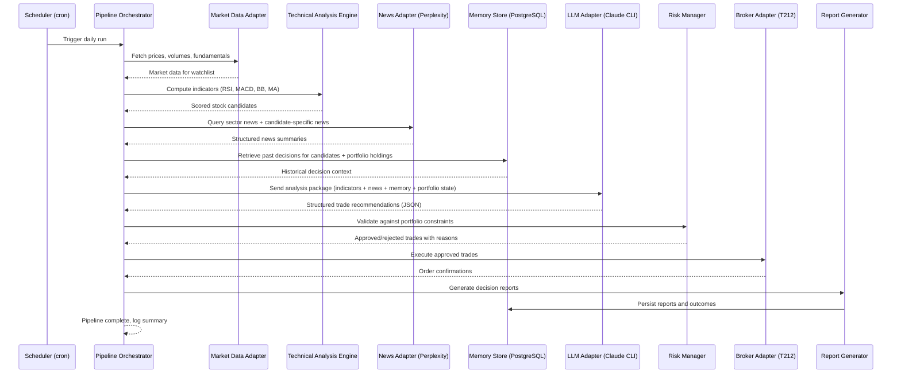
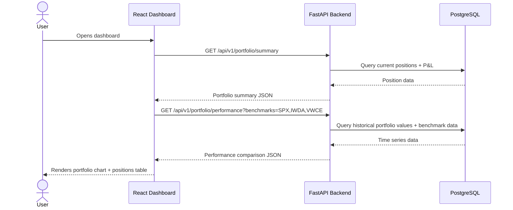
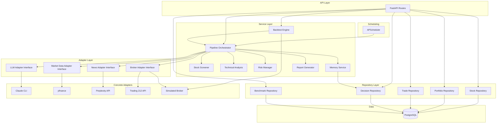
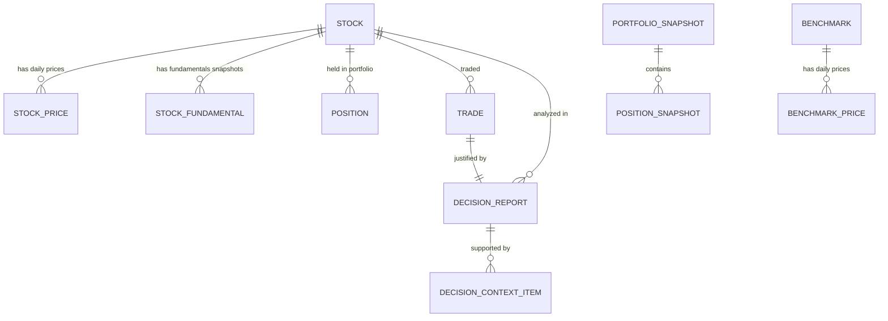
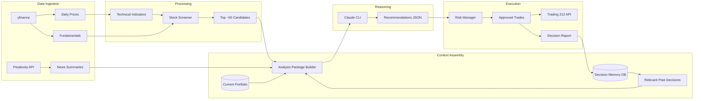
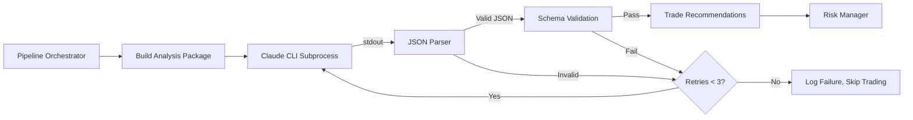
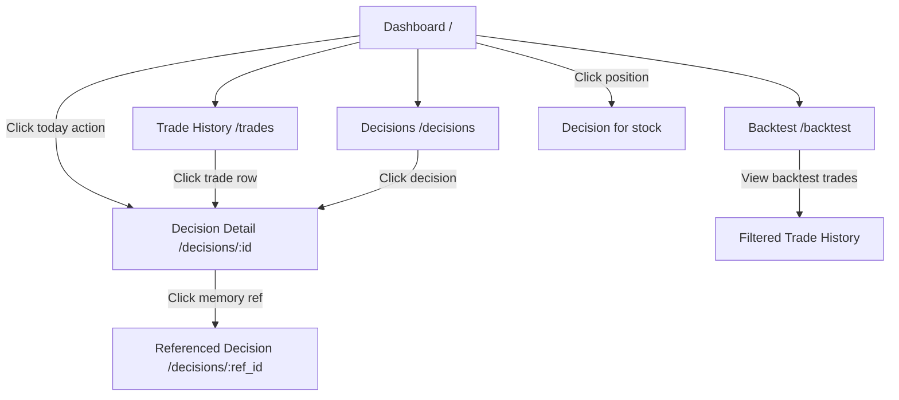

# TradeAgent - Product Requirements Document

## 1. Overview

### 1.1 Problem Statement
Retail investors struggle to consistently outperform broad market indices (S&P 500) because they lack the time and discipline to systematically analyze global market data, news sentiment, technical indicators, and company fundamentals across hundreds of stocks daily, and to make emotion-free, data-driven buy/sell decisions.

### 1.2 Business Context
Active stock picking by retail investors underperforms index funds in ~90% of cases over a 10-year horizon. The primary reasons are emotional decision-making, information overload, and inconsistent analysis. An autonomous agent that combines quantitative technical analysis with LLM-powered contextual reasoning (news, earnings, macro events) could eliminate these weaknesses. This is a personal tool, not a commercial product. It runs against a Trading 212 Practice account for MVP, meaning no real money is at risk. The cost of not building it is continuing to invest passively; the upside is a system that learns from its own decisions and potentially identifies alpha in undervalued global equities.

### 1.3 Product Description
TradeAgent is a Python-based autonomous trading system that runs a daily analysis pipeline. It ingests global stock market data and technical indicators via yfinance, gathers world news and company intelligence via Perplexity API, retrieves its own past decision history for context, then feeds all of this into an LLM (Claude Code CLI) to generate structured trade recommendations. Approved trades are executed against the Trading 212 Practice API. Every decision is logged with full context as a "decision report" that feeds back into the agent's memory for future learning. A React dashboard visualizes portfolio performance, individual stock positions, and benchmark comparisons (S&P 500, IWDA, VWCE).

### 1.4 Success Criteria
- [ ] Agent completes a full daily pipeline run (data ingestion -> analysis -> trade execution -> report generation) without manual intervention (P10)
- [ ] Agent generates a structured decision report for every trade, including the data and reasoning that led to the decision (P10)
- [ ] Agent retrieves and incorporates past decision outcomes when making new decisions (P9)
- [ ] Dashboard displays current portfolio holdings with per-stock P&L and total portfolio value (P9)
- [ ] Dashboard displays portfolio performance vs S&P 500, IWDA, and VWCE benchmarks over time (P9)
- [ ] Backtesting engine can replay historical data through the same pipeline and produce a performance report (P8)
- [ ] All external integrations (LLM, news, market data, broker) are swappable via adapter pattern without code changes to the core pipeline (P8)

### 1.5 Scope Boundaries
**In Scope (v1/MVP):**
- Daily automated pipeline: data ingestion, technical analysis, news gathering, LLM reasoning, trade execution
- Trading 212 Practice API integration (paper trading only)
- Global stock universe via yfinance (US, EU, emerging markets)
- Technical indicators: RSI, MACD, Bollinger Bands, Moving Averages (SMA/EMA), Volume analysis, P/E ratio screening
- News and context gathering via Perplexity API
- LLM-based trade reasoning via Claude Code CLI subprocess
- Decision report generation and persistent memory/learning system
- Backtesting engine for historical simulation
- React dashboard with portfolio view, trade log, and benchmark comparison
- Configurable portfolio constraints (max positions, max allocation per stock)
- Docker Compose local deployment

**Explicitly Out of Scope:**
- Real money trading (live Trading 212 API). Do NOT build, scaffold, or prepare for this beyond having the broker adapter pattern.
- Intraday trading or real-time streaming data. The agent runs once daily.
- Options, futures, forex, or crypto trading. Equities only.
- Social trading, copy trading, or multi-user features. Single user only.
- Mobile app or responsive design. Desktop-first dashboard.
- User authentication on the dashboard. It runs locally, no auth needed for MVP.
- Custom model training or fine-tuning. Off-the-shelf LLM via CLI only.
- Automated stop-loss or trailing stop orders on the broker side. The agent makes daily decisions; it does not monitor intraday price movements.
- Tax reporting or accounting features.
- Notification system (email, SMS, push). The user checks the dashboard.
- Automated rebalancing based on target allocations (e.g., Pie feature of Trading 212). The agent makes individual stock decisions.

---

## 2. User Personas & Scenarios

### 2.1 User Personas

**Persona: Portfolio Owner (sole user)**
- **Description**: A technically proficient Data & AI Architect who wants to run an autonomous trading agent against a paper trading account to test whether LLM-augmented technical analysis can outperform passive index investing.
- **Goals**: Review the agent's daily decisions and rationale, monitor portfolio performance vs benchmarks, tune agent parameters (risk limits, stock universe, indicators), run backtests on historical data.
- **Permissions**: Full access to everything. No RBAC needed.
- **Technical Skill Level**: High. Comfortable with Python, SQL, Docker, CLI tools, and reading logs.

### 2.2 User Scenarios

**Scenario: Morning Portfolio Review**
> Alex is a Data & AI Architect who wakes up and opens the TradeAgent dashboard on his laptop. The agent ran its daily pipeline at 07:00 UTC (before most European markets open). Alex sees the dashboard's "Today's Actions" panel showing that the agent bought 15 shares of ASML (flagged as undervalued based on recent semiconductor sector news + RSI below 30) and sold its position in Shell (flagged as overvalued after energy sector downturn signals). Alex clicks on the ASML decision to read the full report: the agent cites three Perplexity-sourced news items about EU semiconductor investment, the RSI and MACD cross signals, and notes that its last two semiconductor plays (TSMC, Samsung) returned +12% and +8% respectively. Alex nods, checks the portfolio vs S&P 500 chart (currently +2.3% ahead YTD), and closes the dashboard.

**Scenario: Investigating a Losing Position**
> Alex notices that Alibaba (BABA) has been declining for 3 weeks and the agent hasn't sold. Alex clicks into the BABA position detail and sees the agent's latest decision report: "Holding BABA. Technical indicators show oversold (RSI 22), but news sentiment is negative (regulatory concerns). Historical memory shows that holding through oversold conditions in previous cases (Meta Q3 2023, JD.com Jan 2024) yielded +18% and +11% recovery within 60 days. Maintaining position with review next cycle." Alex can see the confidence score (0.62, moderate) and the specific past decisions the agent referenced. Alex decides to trust the agent's reasoning but makes a mental note to check again next week.

**Scenario: Running a Backtest**
> Alex wants to test whether the agent's strategy would have worked in 2023. He runs a CLI command: `docker exec tradeagent python -m tradeagent.backtest --start 2023-01-01 --end 2023-12-31 --initial-capital 50000`. The backtest replays each trading day through the same pipeline (minus actual broker execution). After completion, Alex opens the dashboard's backtest view showing the simulated portfolio returned +22% vs S&P 500's +24%. Alex inspects individual decisions, tweaks the technical indicator thresholds in the config, and reruns.

**Scenario: Changing Agent Configuration**
> Alex decides to increase the maximum number of concurrent positions from 20 to 30 and reduce per-position allocation from 5% to 4%. He edits the `config.yaml` file, changes `max_positions: 30` and `max_position_pct: 4.0`, and restarts the agent container. The next daily run respects the new constraints. No code changes needed.

### 2.3 User Flows

**Flow: Daily Pipeline Execution (P10)**



- **Happy path result**: All trades executed, reports stored, portfolio state updated.
- **Error states**:
  - Market data fetch fails: Log error, skip today's run, retry next day. Do NOT trade on stale data.
  - News API fails: Proceed with technical indicators only. Flag in report that news context was unavailable.
  - LLM fails or returns unparseable output: Log the raw output, skip trading for this cycle, retry with exponential backoff (max 3 retries).
  - Broker API fails: Log error, store intended trades as "pending", retry execution in 30 minutes (max 2 retries). If still failing, mark as "failed" and alert in dashboard.
  - Risk check rejects all trades: Log reasons, no trades executed. This is a valid outcome (no good opportunities today).

**Flow: Dashboard Portfolio View (P9)**



- **Happy path result**: Dashboard shows current positions, total P&L, and performance chart with benchmark overlays.
- **Error states**: API unreachable: Show cached last-known state with "Last updated: [timestamp]" warning.

---

## 3. Technical Architecture

### 3.1 Tech Stack

| Layer | Technology | Version | Rationale |
|-------|-----------|---------|-----------|
| Language | Python | 3.12+ | Primary language, excellent financial/ML library ecosystem |
| Backend Framework | FastAPI | 0.115+ | Async, fast, auto-generated OpenAPI docs, Pydantic integration |
| Database | PostgreSQL | 16+ | Robust SQL, good for time-series queries with proper indexing, known well by the developer |
| ORM | SQLAlchemy | 2.0+ | Mature, async support, Alembic integration |
| Migrations | Alembic | 1.13+ | Standard for SQLAlchemy migrations |
| Frontend | React + Vite | React 18+ / Vite 5+ | Fast dev server, modern tooling |
| Charting | Recharts or Lightweight Charts (TradingView) | Latest | TradingView Lightweight Charts for financial data; Recharts for general charts |
| Technical Analysis | pandas-ta | 0.3.14b+ | Comprehensive TA indicators library, pandas-native |
| Market Data | yfinance | 0.2.36+ | Free, covers global markets, fundamentals included |
| News/Intelligence | Perplexity API (sonar model) | Latest | Structured answers with citations, good for financial news |
| LLM Reasoning | Claude Code CLI (subprocess) | Latest | Avoids API costs, uses Pro subscription, swappable via adapter |
| Task Scheduling | APScheduler | 3.10+ | In-process cron-like scheduling, simpler than Celery for single-node |
| Containerization | Docker + Docker Compose | Latest | Local deployment, PostgreSQL + app containers |
| HTTP Client | httpx | 0.27+ | Async HTTP client for broker and news API calls |
| Config Management | Pydantic Settings | 2.0+ | Type-safe config from env vars and YAML |
| Testing | pytest + pytest-asyncio | Latest | Standard Python testing |

### 3.2 Project Structure

```
tradeagent/
├── src/
│   └── tradeagent/
│       ├── __init__.py
│       ├── main.py                          # FastAPI app entry point
│       ├── config.py                        # Pydantic Settings, loads config.yaml + env vars
│       ├── scheduler.py                     # APScheduler daily pipeline trigger
│       ├── api/
│       │   ├── __init__.py
│       │   ├── routes/
│       │   │   ├── __init__.py
│       │   │   ├── portfolio.py             # Portfolio endpoints
│       │   │   ├── trades.py                # Trade history endpoints
│       │   │   ├── decisions.py             # Decision report endpoints
│       │   │   ├── backtest.py              # Backtest trigger + results endpoints
│       │   │   └── health.py                # Health check
│       │   └── dependencies.py              # Shared FastAPI dependencies
│       ├── core/
│       │   ├── __init__.py
│       │   ├── exceptions.py                # Custom exception hierarchy
│       │   ├── logging.py                   # Structured logging setup
│       │   └── types.py                     # Shared type definitions, enums
│       ├── models/
│       │   ├── __init__.py
│       │   ├── base.py                      # SQLAlchemy base, common mixins
│       │   ├── stock.py                     # Stock, StockPrice, StockFundamentals
│       │   ├── portfolio.py                 # Position, PortfolioSnapshot
│       │   ├── trade.py                     # Trade, TradeOrder
│       │   ├── decision.py                  # DecisionReport, DecisionOutcome
│       │   └── benchmark.py                 # BenchmarkPrice
│       ├── schemas/
│       │   ├── __init__.py
│       │   ├── portfolio.py                 # Pydantic response/request schemas
│       │   ├── trade.py
│       │   ├── decision.py
│       │   └── backtest.py
│       ├── services/
│       │   ├── __init__.py
│       │   ├── pipeline.py                  # Daily pipeline orchestrator
│       │   ├── screening.py                 # Stock universe filtering + scoring
│       │   ├── technical_analysis.py        # TA indicator computation
│       │   ├── risk_manager.py              # Position sizing, constraint validation
│       │   ├── memory.py                    # Decision memory retrieval + storage
│       │   ├── report_generator.py          # Decision report creation
│       │   └── backtest.py                  # Backtesting engine
│       ├── adapters/
│       │   ├── __init__.py
│       │   ├── base.py                      # Abstract base classes for all adapters
│       │   ├── llm/
│       │   │   ├── __init__.py
│       │   │   ├── base.py                  # LLMAdapter ABC
│       │   │   ├── claude_cli.py            # Claude Code CLI subprocess adapter
│       │   │   └── prompts/
│       │   │       ├── system_prompt.md      # Main system prompt for trade analysis
│       │   │       └── report_prompt.md      # Prompt for generating decision reports
│       │   ├── market_data/
│       │   │   ├── __init__.py
│       │   │   ├── base.py                  # MarketDataAdapter ABC
│       │   │   └── yfinance_adapter.py      # yfinance implementation
│       │   ├── news/
│       │   │   ├── __init__.py
│       │   │   ├── base.py                  # NewsAdapter ABC
│       │   │   └── perplexity_adapter.py    # Perplexity API implementation
│       │   └── broker/
│       │       ├── __init__.py
│       │       ├── base.py                  # BrokerAdapter ABC
│       │       ├── trading212.py            # Trading 212 API implementation
│       │       └── simulated.py             # Simulated broker for backtesting
│       └── repositories/
│           ├── __init__.py
│           ├── stock.py
│           ├── portfolio.py
│           ├── trade.py
│           ├── decision.py
│           └── benchmark.py
├── frontend/
│   ├── package.json
│   ├── vite.config.ts
│   ├── tsconfig.json
│   ├── index.html
│   ├── src/
│   │   ├── main.tsx
│   │   ├── App.tsx
│   │   ├── api/
│   │   │   └── client.ts                    # API client (fetch wrapper)
│   │   ├── components/
│   │   │   ├── layout/
│   │   │   │   ├── Sidebar.tsx
│   │   │   │   └── Layout.tsx
│   │   │   ├── portfolio/
│   │   │   │   ├── PortfolioSummary.tsx
│   │   │   │   ├── PositionsTable.tsx
│   │   │   │   └── PerformanceChart.tsx
│   │   │   ├── trades/
│   │   │   │   ├── TradeLog.tsx
│   │   │   │   └── TradeDetail.tsx
│   │   │   ├── decisions/
│   │   │   │   ├── DecisionList.tsx
│   │   │   │   └── DecisionReport.tsx
│   │   │   └── backtest/
│   │   │       ├── BacktestForm.tsx
│   │   │       └── BacktestResults.tsx
│   │   ├── pages/
│   │   │   ├── DashboardPage.tsx
│   │   │   ├── TradesPage.tsx
│   │   │   ├── DecisionsPage.tsx
│   │   │   └── BacktestPage.tsx
│   │   └── hooks/
│   │       └── useApi.ts
│   └── public/
├── tests/
│   ├── __init__.py
│   ├── conftest.py                          # Shared fixtures, test DB setup
│   ├── unit/
│   │   ├── __init__.py
│   │   ├── test_screening.py
│   │   ├── test_technical_analysis.py
│   │   ├── test_risk_manager.py
│   │   ├── test_memory.py
│   │   └── test_report_generator.py
│   ├── integration/
│   │   ├── __init__.py
│   │   ├── test_pipeline.py
│   │   ├── test_adapters.py
│   │   └── test_api_routes.py
│   └── backtest/
│       ├── __init__.py
│       └── test_backtest_engine.py
├── scripts/
│   ├── seed_watchlist.py                    # Populate initial stock watchlist
│   ├── seed_benchmarks.py                   # Fetch historical benchmark data
│   └── run_pipeline.py                      # Manual pipeline trigger
├── alembic/
│   ├── alembic.ini
│   ├── env.py
│   └── versions/
├── config/
│   ├── config.yaml                          # Default configuration
│   └── config.example.yaml                  # Example config for documentation
├── docker-compose.yml
├── Dockerfile
├── pyproject.toml
├── README.md
└── .env.example
```

### 3.3 Architecture Pattern

Layered architecture with adapter pattern for all external integrations. The core pipeline and business logic have zero direct dependencies on external services. All external I/O goes through abstract adapter interfaces.



### 3.4 Key Design Decisions

- **Adapter pattern for ALL external services**: Every external integration (LLM, market data, news, broker) is behind an abstract interface. Concrete implementations are injected via configuration. This is a P10 requirement because the user explicitly needs to swap providers without code changes.
- **Claude Code CLI via subprocess, not API**: MVP uses `claude` CLI to avoid API costs. The LLM adapter wraps subprocess calls, sends a prompt via stdin/file, and parses stdout. This is inherently fragile. The adapter must handle: non-JSON output (retry with "respond only in JSON" reinforcement), timeouts (60s default), CLI not found errors (clear error message), and rate limiting (exponential backoff). Design the adapter interface so swapping to `anthropic` Python SDK requires only a new adapter class and a config change.
- **Daily batch pipeline, not event-driven**: Simplifies everything. One pipeline run per day, triggered by APScheduler. No message queues, no streaming, no WebSockets for MVP.
- **PostgreSQL for everything**: Market data, trade history, decision reports, portfolio snapshots, and agent memory all live in PostgreSQL. No separate vector store for MVP. The memory system uses keyword-based retrieval (stock ticker, sector, date range) with SQL queries, not semantic search. This is intentionally simple. Semantic search over decision history is a P3 future enhancement.
- **Backtesting reuses the same pipeline**: The backtest engine replaces the real broker adapter with a simulated one and replays historical market data day by day through the exact same pipeline. This ensures backtest results are representative of live behavior. The LLM adapter is also called during backtesting (this is slow but accurate; a "fast backtest" mode that skips LLM is a P5 enhancement).
- **Config-driven constraints**: All portfolio rules (max positions, max per-position %, stock universe filters, indicator thresholds) are in `config.yaml`. No code changes needed to tune the agent.
- **No authentication on dashboard**: Runs locally via Docker Compose. Adding auth is unnecessary overhead for a single-user local tool.

---

## 4. Data Model

### 4.1 Entity Relationship Diagram



**Entity: stock**

| Field | Type | Constraints | Description |
|-------|------|-------------|-------------|
| id | SERIAL | PK | Internal ID |
| ticker | VARCHAR(20) | UNIQUE, NOT NULL | Stock ticker symbol (e.g., "AAPL", "ASML.AS") |
| name | VARCHAR(255) | NOT NULL | Company name |
| exchange | VARCHAR(50) | NOT NULL | Exchange (e.g., "NYSE", "AMS", "XETRA") |
| sector | VARCHAR(100) | NULL | GICS sector |
| industry | VARCHAR(100) | NULL | GICS industry |
| country | VARCHAR(50) | NULL | Country of incorporation |
| currency | VARCHAR(10) | NOT NULL | Trading currency (e.g., "USD", "EUR") |
| is_active | BOOLEAN | NOT NULL, DEFAULT TRUE | Whether the stock is in the active watchlist |
| created_at | TIMESTAMPTZ | NOT NULL, DEFAULT NOW() | When added to watchlist |
| updated_at | TIMESTAMPTZ | NOT NULL, DEFAULT NOW() | Last metadata update |

**Entity: stock_price**

| Field | Type | Constraints | Description |
|-------|------|-------------|-------------|
| id | BIGSERIAL | PK | Internal ID |
| stock_id | INTEGER | FK -> stock.id, NOT NULL | Reference to stock |
| date | DATE | NOT NULL | Trading date |
| open | NUMERIC(12,4) | NOT NULL | Open price |
| high | NUMERIC(12,4) | NOT NULL | High price |
| low | NUMERIC(12,4) | NOT NULL | Low price |
| close | NUMERIC(12,4) | NOT NULL | Close price |
| adj_close | NUMERIC(12,4) | NOT NULL | Adjusted close price |
| volume | BIGINT | NOT NULL | Trading volume |

**Unique constraint**: (stock_id, date)
**Index**: (stock_id, date DESC) for fast latest-price lookups

**Entity: stock_fundamental**

| Field | Type | Constraints | Description |
|-------|------|-------------|-------------|
| id | BIGSERIAL | PK | Internal ID |
| stock_id | INTEGER | FK -> stock.id, NOT NULL | Reference to stock |
| snapshot_date | DATE | NOT NULL | When this data was captured |
| market_cap | NUMERIC(18,2) | NULL | Market capitalization |
| pe_ratio | NUMERIC(10,4) | NULL | Price-to-earnings ratio (trailing) |
| forward_pe | NUMERIC(10,4) | NULL | Forward P/E ratio |
| pb_ratio | NUMERIC(10,4) | NULL | Price-to-book ratio |
| dividend_yield | NUMERIC(8,6) | NULL | Dividend yield (decimal, e.g., 0.025 = 2.5%) |
| eps | NUMERIC(10,4) | NULL | Earnings per share |
| revenue | NUMERIC(18,2) | NULL | Total revenue (TTM) |
| profit_margin | NUMERIC(8,6) | NULL | Profit margin (decimal) |
| debt_to_equity | NUMERIC(10,4) | NULL | Debt/equity ratio |
| free_cash_flow | NUMERIC(18,2) | NULL | Free cash flow |
| beta | NUMERIC(8,4) | NULL | Beta (volatility vs market) |
| fifty_two_week_high | NUMERIC(12,4) | NULL | 52-week high |
| fifty_two_week_low | NUMERIC(12,4) | NULL | 52-week low |
| next_earnings_date | DATE | NULL | Next earnings date if known |

**Unique constraint**: (stock_id, snapshot_date)

**Entity: position**

| Field | Type | Constraints | Description |
|-------|------|-------------|-------------|
| id | SERIAL | PK | Internal ID |
| stock_id | INTEGER | FK -> stock.id, NOT NULL | Which stock |
| quantity | NUMERIC(12,6) | NOT NULL | Number of shares held (fractional allowed) |
| avg_price | NUMERIC(12,4) | NOT NULL | Average purchase price per share |
| currency | VARCHAR(10) | NOT NULL | Currency of the position |
| opened_at | TIMESTAMPTZ | NOT NULL | When the position was first opened |
| closed_at | TIMESTAMPTZ | NULL | When fully closed (NULL if still open) |
| status | VARCHAR(20) | NOT NULL, DEFAULT 'OPEN' | OPEN, CLOSED |

**Index**: (status) WHERE status = 'OPEN' (partial index for fast open position queries)

**Entity: trade**

| Field | Type | Constraints | Description |
|-------|------|-------------|-------------|
| id | SERIAL | PK | Internal ID |
| stock_id | INTEGER | FK -> stock.id, NOT NULL | Which stock was traded |
| decision_report_id | INTEGER | FK -> decision_report.id, NULL | Which decision triggered this trade |
| side | VARCHAR(4) | NOT NULL, CHECK IN ('BUY','SELL') | Trade direction |
| quantity | NUMERIC(12,6) | NOT NULL | Number of shares |
| price | NUMERIC(12,4) | NOT NULL | Execution price |
| total_value | NUMERIC(14,4) | NOT NULL | quantity * price |
| currency | VARCHAR(10) | NOT NULL | Trade currency |
| broker_order_id | VARCHAR(100) | NULL | External order ID from Trading 212 |
| status | VARCHAR(20) | NOT NULL | PENDING, FILLED, FAILED, CANCELLED |
| executed_at | TIMESTAMPTZ | NULL | When the order was filled |
| created_at | TIMESTAMPTZ | NOT NULL, DEFAULT NOW() | When the trade was created |
| is_backtest | BOOLEAN | NOT NULL, DEFAULT FALSE | Whether this is a backtest trade |
| backtest_run_id | UUID | NULL | Groups trades belonging to the same backtest run |

**Entity: decision_report**

| Field | Type | Constraints | Description |
|-------|------|-------------|-------------|
| id | SERIAL | PK | Internal ID |
| stock_id | INTEGER | FK -> stock.id, NOT NULL | Which stock this decision is about |
| pipeline_run_id | UUID | NOT NULL | Groups decisions from the same pipeline run |
| action | VARCHAR(10) | NOT NULL, CHECK IN ('BUY','SELL','HOLD') | Recommended action |
| confidence | NUMERIC(4,3) | NOT NULL, CHECK 0.0..1.0 | Agent's confidence score (0.0 to 1.0) |
| reasoning | TEXT | NOT NULL | LLM's full reasoning text |
| technical_summary | JSONB | NOT NULL | Technical indicator values at time of decision |
| news_summary | JSONB | NOT NULL | News items and sentiment that informed the decision |
| memory_references | JSONB | NULL | Past decision IDs and outcomes the agent referenced |
| portfolio_state | JSONB | NOT NULL | Portfolio snapshot at decision time (cash, positions, total value) |
| outcome_pnl | NUMERIC(12,4) | NULL | P&L outcome (updated retroactively when position closes or after N days) |
| outcome_benchmark_delta | NUMERIC(8,4) | NULL | Performance vs S&P 500 over same period |
| outcome_assessed_at | TIMESTAMPTZ | NULL | When the outcome was last assessed |
| created_at | TIMESTAMPTZ | NOT NULL, DEFAULT NOW() | When the decision was made |
| is_backtest | BOOLEAN | NOT NULL, DEFAULT FALSE | Whether this is a backtest decision |
| backtest_run_id | UUID | NULL | Groups decisions belonging to the same backtest run |

**Entity: decision_context_item**

| Field | Type | Constraints | Description |
|-------|------|-------------|-------------|
| id | BIGSERIAL | PK | Internal ID |
| decision_report_id | INTEGER | FK -> decision_report.id, NOT NULL | Parent decision |
| context_type | VARCHAR(30) | NOT NULL | "news", "technical", "fundamental", "memory", "macro" |
| source | VARCHAR(255) | NOT NULL | Where this context came from (e.g., "perplexity", "yfinance", "memory:decision:42") |
| content | TEXT | NOT NULL | The actual context content |
| relevance_score | NUMERIC(4,3) | NULL | How relevant the agent deemed this (0.0 to 1.0) |
| created_at | TIMESTAMPTZ | NOT NULL, DEFAULT NOW() | When captured |

**Entity: portfolio_snapshot**

| Field | Type | Constraints | Description |
|-------|------|-------------|-------------|
| id | SERIAL | PK | Internal ID |
| date | DATE | UNIQUE, NOT NULL | Snapshot date |
| total_value | NUMERIC(14,4) | NOT NULL | Total portfolio value (cash + positions) |
| cash | NUMERIC(14,4) | NOT NULL | Available cash |
| invested | NUMERIC(14,4) | NOT NULL | Value of all open positions |
| daily_pnl | NUMERIC(12,4) | NOT NULL | Day-over-day change |
| cumulative_pnl_pct | NUMERIC(8,4) | NOT NULL | Cumulative return % since inception |
| num_positions | INTEGER | NOT NULL | Number of open positions |
| is_backtest | BOOLEAN | NOT NULL, DEFAULT FALSE | Whether this is a backtest snapshot |
| backtest_run_id | UUID | NULL | Groups snapshots belonging to same backtest run |

**Entity: position_snapshot**

| Field | Type | Constraints | Description |
|-------|------|-------------|-------------|
| id | BIGSERIAL | PK | Internal ID |
| portfolio_snapshot_id | INTEGER | FK -> portfolio_snapshot.id, NOT NULL | Parent snapshot |
| stock_id | INTEGER | FK -> stock.id, NOT NULL | Which stock |
| quantity | NUMERIC(12,6) | NOT NULL | Shares held |
| market_value | NUMERIC(14,4) | NOT NULL | Current market value |
| unrealized_pnl | NUMERIC(12,4) | NOT NULL | Unrealized P&L |
| weight_pct | NUMERIC(6,3) | NOT NULL | % of total portfolio |

**Entity: benchmark**

| Field | Type | Constraints | Description |
|-------|------|-------------|-------------|
| id | SERIAL | PK | Internal ID |
| symbol | VARCHAR(20) | UNIQUE, NOT NULL | Benchmark symbol (e.g., "^GSPC", "IWDA.AS", "VWCE.DE") |
| name | VARCHAR(100) | NOT NULL | Display name (e.g., "S&P 500", "IWDA", "VWCE") |

**Entity: benchmark_price**

| Field | Type | Constraints | Description |
|-------|------|-------------|-------------|
| id | BIGSERIAL | PK | Internal ID |
| benchmark_id | INTEGER | FK -> benchmark.id, NOT NULL | Reference to benchmark |
| date | DATE | NOT NULL | Trading date |
| close | NUMERIC(12,4) | NOT NULL | Close price |

**Unique constraint**: (benchmark_id, date)

**Relationships:**
- stock has many stock_price (one-to-many, daily prices)
- stock has many stock_fundamental (one-to-many, periodic snapshots)
- stock has many position (one-to-many, can have multiple positions over time)
- stock has many trade (one-to-many)
- stock has many decision_report (one-to-many)
- trade belongs to decision_report (many-to-one, nullable for manual adjustments)
- decision_report has many decision_context_item (one-to-many)
- portfolio_snapshot has many position_snapshot (one-to-many)
- benchmark has many benchmark_price (one-to-many)

### 4.2 Database Migrations Strategy
Alembic with auto-generation from SQLAlchemy models. Each migration is reviewed before applying. Migrations run automatically on container startup via the entrypoint script.

### 4.3 Seed Data

**Benchmarks** (P10): Seed the `benchmark` table with:

| symbol | name |
|--------|------|
| ^GSPC | S&P 500 |
| IWDA.AS | iShares Core MSCI World |
| VWCE.DE | Vanguard FTSE All-World |

**Watchlist** (P10): Seed `stock` table with an initial watchlist. The `scripts/seed_watchlist.py` script fetches the constituents of major indices (S&P 500, STOXX 600, and selected emerging market large-caps) from yfinance and populates the stock table. Target: ~800-1200 stocks initially. The agent's screening step narrows this to ~50-100 candidates per day before detailed analysis.

**Historical benchmark prices** (P9): `scripts/seed_benchmarks.py` fetches 3 years of historical daily closes for each benchmark from yfinance.

---

## 5. API Specification

### 5.1 API Design Principles

REST API, no versioning prefix for MVP (all endpoints under `/api/`). Pagination via cursor-based approach for time-series data. Standard error responses throughout.

**Standard Error Response Format:**
```json
{
  "error": {
    "code": "VALIDATION_ERROR",
    "message": "Human-readable description",
    "details": [{"field": "start_date", "issue": "Must be before end_date"}]
  }
}
```

**Standard Pagination (for list endpoints):**
```json
{
  "data": [...],
  "pagination": {
    "total": 150,
    "limit": 50,
    "offset": 0,
    "has_more": true
  }
}
```

### 5.2 Endpoints

**`GET /api/health` (P10)**
- **Description**: Health check. Returns service status and database connectivity.
- **Auth**: None
- **Response 200**:
```json
{
  "status": "healthy",
  "database": "connected",
  "last_pipeline_run": "2025-02-18T07:00:00Z",
  "last_pipeline_status": "success"
}
```

**`GET /api/portfolio/summary` (P9)**
- **Description**: Current portfolio state: total value, cash, positions with P&L.
- **Auth**: None
- **Response 200**:
```json
{
  "total_value": 52340.50,
  "cash": 12500.00,
  "invested": 39840.50,
  "daily_pnl": 280.30,
  "daily_pnl_pct": 0.54,
  "cumulative_pnl_pct": 4.68,
  "num_positions": 15,
  "positions": [
    {
      "stock_id": 42,
      "ticker": "ASML.AS",
      "name": "ASML Holding",
      "quantity": 5.0,
      "avg_price": 680.50,
      "current_price": 710.20,
      "market_value": 3551.00,
      "unrealized_pnl": 148.50,
      "unrealized_pnl_pct": 4.36,
      "weight_pct": 6.78,
      "held_since": "2025-01-15"
    }
  ],
  "last_updated": "2025-02-18T07:15:00Z"
}
```
- **Error Responses**: 500 (database error)

**`GET /api/portfolio/performance` (P9)**
- **Description**: Historical portfolio performance with benchmark comparison.
- **Query Parameters**:
  - `start_date` (DATE, optional, default: portfolio inception date)
  - `end_date` (DATE, optional, default: today)
  - `benchmarks` (comma-separated strings, optional, default: "SPX,IWDA,VWCE")
- **Response 200**:
```json
{
  "start_date": "2025-01-01",
  "end_date": "2025-02-18",
  "portfolio": [
    {"date": "2025-01-01", "cumulative_return_pct": 0.0, "total_value": 50000.0},
    {"date": "2025-01-02", "cumulative_return_pct": 0.12, "total_value": 50060.0}
  ],
  "benchmarks": {
    "SPX": [
      {"date": "2025-01-01", "cumulative_return_pct": 0.0},
      {"date": "2025-01-02", "cumulative_return_pct": 0.08}
    ],
    "IWDA": [...],
    "VWCE": [...]
  }
}
```
- **Error Responses**: 400 (invalid date range), 500 (database error)

**`GET /api/trades` (P9)**
- **Description**: Paginated trade history.
- **Query Parameters**:
  - `limit` (int, default: 50, max: 200)
  - `offset` (int, default: 0)
  - `ticker` (string, optional, filter by stock ticker)
  - `side` (string, optional, "BUY" or "SELL")
  - `start_date` / `end_date` (DATE, optional)
  - `include_backtest` (bool, default: false)
- **Response 200**:
```json
{
  "data": [
    {
      "id": 101,
      "ticker": "ASML.AS",
      "name": "ASML Holding",
      "side": "BUY",
      "quantity": 5.0,
      "price": 680.50,
      "total_value": 3402.50,
      "status": "FILLED",
      "decision_report_id": 88,
      "executed_at": "2025-01-15T08:02:00Z"
    }
  ],
  "pagination": {"total": 83, "limit": 50, "offset": 0, "has_more": true}
}
```
- **Error Responses**: 400 (invalid parameters), 500 (database error)

**`GET /api/decisions` (P9)**
- **Description**: Paginated decision reports.
- **Query Parameters**:
  - `limit` (int, default: 20, max: 100)
  - `offset` (int, default: 0)
  - `ticker` (string, optional)
  - `action` (string, optional, "BUY", "SELL", "HOLD")
  - `min_confidence` (float, optional, 0.0-1.0)
  - `start_date` / `end_date` (DATE, optional)
  - `include_backtest` (bool, default: false)
- **Response 200**:
```json
{
  "data": [
    {
      "id": 88,
      "ticker": "ASML.AS",
      "name": "ASML Holding",
      "action": "BUY",
      "confidence": 0.82,
      "reasoning": "RSI at 28 indicates oversold. MACD cross bullish...",
      "technical_summary": {"rsi_14": 28.3, "macd_signal": "bullish_cross", "sma_50_vs_200": "golden_cross"},
      "news_summary": [{"headline": "EU announces €5B semiconductor fund", "sentiment": "positive", "source": "perplexity"}],
      "memory_references": [{"decision_id": 42, "ticker": "TSMC", "outcome_pnl_pct": 12.3}],
      "outcome_pnl": 148.50,
      "outcome_pnl_pct": 4.36,
      "created_at": "2025-01-15T07:00:00Z"
    }
  ],
  "pagination": {"total": 200, "limit": 20, "offset": 0, "has_more": true}
}
```
- **Error Responses**: 400, 500

**`GET /api/decisions/{id}` (P9)**
- **Description**: Full decision report detail including all context items.
- **Response 200**: Same as above but with full `context_items` array included.
- **Error Responses**: 404 (not found), 500

**`POST /api/pipeline/run` (P7)**
- **Description**: Manually trigger a pipeline run (outside the scheduled time).
- **Request Body**: None
- **Response 202**:
```json
{
  "pipeline_run_id": "uuid",
  "status": "started",
  "message": "Pipeline run initiated"
}
```
- **Error Responses**: 409 (pipeline already running), 500
- **Business Rules**: Only one pipeline run can execute at a time. Returns 409 if already in progress.

**`GET /api/pipeline/status` (P7)**
- **Description**: Current pipeline status.
- **Response 200**:
```json
{
  "is_running": false,
  "last_run": {
    "pipeline_run_id": "uuid",
    "status": "success",
    "started_at": "2025-02-18T07:00:00Z",
    "completed_at": "2025-02-18T07:14:32Z",
    "trades_executed": 3,
    "decisions_made": 12,
    "errors": []
  }
}
```

**`POST /api/backtest/run` (P8)**
- **Description**: Start a backtest run.
- **Request Body**:
```json
{
  "start_date": "2023-01-01",
  "end_date": "2023-12-31",
  "initial_capital": 50000.0,
  "config_overrides": {
    "max_positions": 20,
    "max_position_pct": 5.0
  }
}
```
- **Response 202**:
```json
{
  "backtest_run_id": "uuid",
  "status": "started"
}
```
- **Error Responses**: 400 (invalid dates, end before start, future dates), 409 (backtest already running), 500
- **Business Rules**: Only one backtest can run at a time. Backtest dates must be in the past. Maximum backtest range: 5 years.

**`GET /api/backtest/{run_id}` (P8)**
- **Description**: Get backtest results.
- **Response 200**:
```json
{
  "backtest_run_id": "uuid",
  "status": "completed",
  "config": {"start_date": "2023-01-01", "end_date": "2023-12-31", "initial_capital": 50000},
  "results": {
    "final_value": 61000.0,
    "total_return_pct": 22.0,
    "benchmark_returns": {"SPX": 24.2, "IWDA": 20.1, "VWCE": 18.5},
    "max_drawdown_pct": -8.3,
    "sharpe_ratio": 1.2,
    "total_trades": 142,
    "win_rate_pct": 58.0,
    "avg_holding_days": 23.5
  },
  "performance_series": [
    {"date": "2023-01-01", "portfolio_value": 50000, "spx_indexed": 50000}
  ]
}
```
- **Error Responses**: 404, 500

### 5.3 Authentication & Authorization
Not applicable for MVP. The dashboard and API run locally on Docker. No authentication required.

---

## 6. ML/AI Specification

### 6.1 ML Task Overview

| Feature | ML Task Type | Input | Output | Priority |
|---------|-------------|-------|--------|----------|
| Trade Reasoning | LLM analysis (structured decision-making) | Technical indicators + news + fundamentals + memory context | Structured JSON with action, confidence, reasoning | P10 |
| News Summarization | LLM extraction (via Perplexity) | Natural language queries about sectors/stocks | Structured news summaries with sentiment | P10 |
| Decision Outcome Assessment | Heuristic + LLM | Historical decision + actual market outcome | Updated memory entry with success/failure assessment | P8 |

### 6.2 Model Strategy

**Feature: Trade Reasoning (P10)**
- **Approach**: Off-the-shelf LLM via Claude Code CLI. No fine-tuning.
- **Model**: Claude (whatever model the user's Claude Code CLI is configured to use, likely Sonnet 4 or Opus)
- **Provider**: Anthropic (via Claude Code CLI subprocess)
- **Fallback**: If Claude CLI fails after 3 retries (timeout, parse error, CLI not found):
  1. Log the failure with full context.
  2. Skip trading for this cycle.
  3. Mark pipeline run as "partial_failure" in status.
  4. Do NOT fall back to a simpler heuristic for trading decisions. It is safer to not trade than to trade on degraded reasoning.
- **Cost Constraints**: $0 incremental (uses Pro subscription). If switching to API in the future: budget cap of $30/month, which at ~$3/million input tokens (Sonnet) allows ~10M tokens/month. With ~50 candidates/day * ~2000 tokens/candidate = ~100K tokens/day = ~3M tokens/month. Well within budget.

**Feature: News Intelligence (P10)**
- **Approach**: Perplexity API (sonar model) for structured search with citations.
- **Model**: sonar (Perplexity's latest search model)
- **Provider**: Perplexity AI
- **Fallback**: If Perplexity API fails:
  1. Retry 2 times with exponential backoff (2s, 4s).
  2. If still failing, proceed with technical indicators only.
  3. Flag in decision report: "News context unavailable for this decision."
- **Cost Constraints**: Perplexity sonar API pricing is ~$1 per 1000 queries. Daily usage: ~5-10 queries per pipeline run (sector overviews + top candidate deep-dives). Monthly cost: ~$5-10.

### 6.3 LLM Configuration

**Feature: Trade Reasoning**

- **System Prompt** (stored at `src/tradeagent/adapters/llm/prompts/system_prompt.md`):

```
You are a quantitative equity analyst agent. Your job is to analyze stock data and make buy/sell/hold recommendations.

You will receive a structured analysis package containing:
1. PORTFOLIO STATE: Current cash, positions, total value, constraints
2. STOCK CANDIDATES: A list of stocks with their technical indicators and fundamentals
3. CURRENT HOLDINGS: Stocks currently in the portfolio with their performance
4. NEWS CONTEXT: Recent news summaries relevant to the candidates and holdings
5. MEMORY: Past decisions you made on similar stocks/sectors and their outcomes

For each stock candidate and current holding, you must decide: BUY, SELL, or HOLD.

RULES:
- You MUST respond with valid JSON only. No markdown, no explanation outside the JSON.
- Confidence score is 0.0 (no confidence) to 1.0 (maximum confidence).
- Only recommend BUY if confidence >= 0.6
- Only recommend SELL a current holding if confidence >= 0.5
- HOLD is the default. When in doubt, HOLD.
- Never recommend buying a stock already in the portfolio (increase position is not supported in MVP).
- Consider your past decisions and their outcomes. If a pattern (sector + signal combination) has historically underperformed, factor that in.
- Provide clear reasoning that references specific data points (indicator values, news items, past outcomes).

RESPONSE SCHEMA:
{
  "recommendations": [
    {
      "ticker": "ASML.AS",
      "action": "BUY" | "SELL" | "HOLD",
      "confidence": 0.82,
      "reasoning": "string explaining why, referencing specific data points",
      "key_signals": ["RSI oversold at 28", "Bullish MACD cross", "EU semiconductor fund news"],
      "risk_factors": ["High valuation relative to sector", "Geopolitical risk"]
    }
  ],
  "market_outlook": "Brief 1-2 sentence overall market assessment",
  "skip_trading": false
}

If market conditions are extremely uncertain (e.g., major crash, circuit breakers), set skip_trading to true and explain in market_outlook.
```

- **Temperature**: 0.3 (low, for more deterministic analysis; we want consistency, not creativity)
- **Max Tokens**: Input: ~15,000 tokens per run (50 candidates * ~200 tokens each + news + memory). Output: ~3,000 tokens max.
- **Structured Output**: JSON schema as defined above. The Claude CLI adapter will extract JSON from the response, retrying up to 2 times if parsing fails.
- **Prompt Versioning**: Prompts stored as markdown files in `src/tradeagent/adapters/llm/prompts/`. Version controlled via git. The prompt file path is specified in `config.yaml` so different prompts can be tested without code changes.
- **Guardrails**:
  - Input validation: The pipeline validates that the analysis package is within token limits before sending. If too large, it reduces the candidate count (lowest-scored candidates dropped first).
  - Output validation: Response must parse as JSON matching the expected schema. If not, retry with a reinforcement prompt: "Your response was not valid JSON. Respond ONLY with the JSON object, no other text."
  - Sanity checks: If the agent recommends buying >5 stocks in a single day, or selling >50% of the portfolio, the risk manager flags it as anomalous and skips execution. Logged for manual review.

### 6.4 Data Pipeline

**Pipeline: Daily Analysis Pipeline (P10)**



- **Source Data**: yfinance for daily OHLCV prices + fundamentals. Perplexity API for news. PostgreSQL for memory.
- **Preprocessing**:
  - Prices: Fetched for all active watchlist stocks. Missing data (holidays, delistings) handled by forward-filling last known price.
  - Fundamentals: Fetched weekly (not daily), as they change infrequently. Stored as snapshots.
  - Technical indicators computed using pandas-ta: RSI(14), MACD(12,26,9), Bollinger Bands(20,2), SMA(50), SMA(200), EMA(12), EMA(26), Volume SMA(20).
- **Screening**: Stocks scored based on a weighted composite of technical signals. Top ~50 candidates (configurable) pass to the LLM for deep analysis. Screening criteria (all configurable in config.yaml):
  - RSI < 30 (oversold) or RSI > 70 (overbought, sell candidates)
  - MACD bullish/bearish crossover in last 3 days
  - Price near Bollinger Band lower/upper boundary
  - Golden/death cross (SMA 50 vs 200)
  - Unusual volume (>1.5x 20-day average)
  - P/E ratio below sector average (value signal)
- **Storage**: All processed data stored in PostgreSQL. Decision reports persisted with full context.
- **Refresh Strategy**: Daily, triggered by APScheduler at configurable time (default: 07:00 UTC).
- **Data Validation**: yfinance data is checked for: missing dates (>5 consecutive missing days = flag stock), zero/negative prices (discard), volume = 0 (flag as suspicious but allow). Pipeline logs all data quality issues.

### 6.5 Evaluation & Monitoring

- **Offline Evaluation (Backtesting)** (P8):
  - Metrics: Total return %, annualized return %, max drawdown %, Sharpe ratio, win rate %, average holding period, benchmark-relative performance (alpha).
  - Baseline: S&P 500 total return over the same period.
  - Evaluation script: `scripts/run_pipeline.py --backtest --start YYYY-MM-DD --end YYYY-MM-DD --capital N`

- **Online Monitoring** (P7):
  - Pipeline run success/failure rate (logged per run)
  - LLM response parse success rate
  - Average LLM response time
  - Trade execution success rate
  - Portfolio value tracked daily in portfolio_snapshot table
  - All monitoring is via structured logging (JSON format) to stdout. No external monitoring service for MVP.

- **Quality Thresholds** (P7):
  - If LLM parse failure rate exceeds 30% over 7 days: Alert in dashboard (banner). Consider switching LLM provider.
  - If portfolio drawdown exceeds 15% from peak: Log warning. Agent continues operating (no automatic shutdown), but dashboard shows a prominent warning.

- **Human-in-the-Loop**: None for MVP. The agent is fully autonomous. The user reviews decisions retroactively via the dashboard. P4 future enhancement: manual approval mode where the agent recommends but doesn't execute until the user approves via the dashboard.

### 6.6 Inference Architecture



- **Sync vs. Async**: Synchronous. The daily pipeline runs as a single sequential process. There is no need for async inference since there is only one LLM call per pipeline run.
- **Caching**: No caching of LLM responses. Each day's analysis is unique.
- **Batching**: Not applicable. Single LLM call per pipeline run containing all candidates.
- **Timeout & Retry**: Claude CLI subprocess timeout: 120 seconds. If timeout, retry up to 2 more times. If all retries fail, skip trading for this cycle.
- **Scaling**: Not applicable for MVP. Single-node, single-user.

---

## 7. User Interface

### 7.1 Pages/Views

**Page: Dashboard (P9)**
- **Route**: `/`
- **Purpose**: Overview of portfolio state and recent activity.
- **Key Components**:
  - Portfolio summary card (total value, cash, daily P&L, cumulative P&L %)
  - Performance chart (portfolio value over time vs benchmarks, line chart with toggle for S&P 500 / IWDA / VWCE)
  - Current positions table (ticker, name, quantity, avg price, current price, unrealized P&L, weight %)
  - "Today's Actions" panel (trades executed in the latest pipeline run, with links to decision reports)
  - Last pipeline run status badge (success/failure/time)
- **User Actions**: Click position row to see stock detail. Click trade to see decision report. Toggle benchmark lines on/off. Change date range for performance chart.
- **State Management**: React state + fetch on mount. No global state library needed for MVP.
- **API Calls**: `GET /api/portfolio/summary`, `GET /api/portfolio/performance`, `GET /api/pipeline/status`
- **Loading States**: Skeleton loaders for chart and table while data loads.
- **Empty States**: "No positions yet. The agent will begin trading on its next scheduled run." with next run time displayed.

**Page: Trade History (P9)**
- **Route**: `/trades`
- **Purpose**: Full trade log with filtering.
- **Key Components**:
  - Filter bar (ticker search, side BUY/SELL, date range)
  - Trade table (date, ticker, side, quantity, price, total value, status, link to decision report)
  - Pagination controls
- **User Actions**: Filter trades, click row to expand/view decision report, paginate.
- **API Calls**: `GET /api/trades`
- **Loading States**: Table skeleton.
- **Empty States**: "No trades executed yet."

**Page: Decisions (P9)**
- **Route**: `/decisions`
- **Purpose**: Browse all decision reports, including HOLD decisions.
- **Key Components**:
  - Filter bar (ticker, action BUY/SELL/HOLD, confidence slider, date range)
  - Decision card list (ticker, action badge, confidence score, 1-line reasoning preview, outcome if available)
  - Click to expand full decision detail
- **User Actions**: Filter, expand decision detail, view referenced past decisions.
- **API Calls**: `GET /api/decisions`, `GET /api/decisions/{id}`
- **Loading States**: Card skeleton.
- **Empty States**: "No decisions yet."

**Page: Decision Detail (P9)**
- **Route**: `/decisions/:id`
- **Purpose**: Full decision report for a single trade/hold decision.
- **Key Components**:
  - Decision header (ticker, action, confidence, date)
  - Reasoning section (full LLM reasoning text)
  - Technical indicators panel (the specific values at decision time)
  - News context panel (news items that informed the decision)
  - Memory references panel (past decisions the agent cited, with their outcomes)
  - Outcome panel (if assessed: actual P&L, benchmark comparison)
- **User Actions**: Click memory references to navigate to those past decisions.
- **API Calls**: `GET /api/decisions/{id}`

**Page: Backtest (P8)**
- **Route**: `/backtest`
- **Purpose**: Run and view backtest results.
- **Key Components**:
  - Backtest form (start date, end date, initial capital, optional config overrides)
  - Run button
  - Results panel (return %, benchmarks, metrics table, performance chart)
  - Backtest trade log (same as trade history but filtered to backtest)
- **User Actions**: Configure and start backtest, view results, browse backtest trades.
- **API Calls**: `POST /api/backtest/run`, `GET /api/backtest/{run_id}`
- **Loading States**: Progress indicator while backtest runs ("Processing day 45 of 252...").
- **Empty States**: "Configure and run a backtest to see results here."

### 7.2 UI/UX Constraints

- **Component library**: Tailwind CSS for styling. No heavy component library. Simple, clean, data-dense layout. Think Bloomberg terminal lite, not consumer app.
- **Charting**: TradingView Lightweight Charts library for the performance/price charts (looks professional, handles financial time-series well). Recharts for simpler bar/pie charts if needed.
- **Responsive**: Desktop-only for MVP. Minimum viewport: 1280px.
- **Color scheme**: Dark theme (dark background, green for gains, red for losses). Consistent with financial dashboards.
- **Accessibility**: Basic keyboard navigation and ARIA labels. Not a priority for MVP but don't actively break it.
- **Data refresh**: Dashboard polls `GET /api/portfolio/summary` every 60 seconds when the tab is active. No WebSocket for MVP.

### 7.3 Navigation Flow



---

## 8. Core Features & Business Logic

### Feature: Stock Screening Engine (P10)
- **User Story**: As the agent, I want to filter the global watchlist (~1000 stocks) down to ~50 actionable candidates daily so that I don't waste LLM tokens analyzing uninteresting stocks.
- **Acceptance Criteria**:
  - [ ] Given a watchlist of 1000+ stocks, when the screener runs, then it produces a ranked list of <= `config.screening.max_candidates` (default 50) stocks.
  - [ ] Given a stock with RSI < 30 and bullish MACD crossover, when scored, then it ranks in the top quartile of candidates.
  - [ ] Given a stock with no price data in the last 5 trading days, when screened, then it is excluded.
- **Business Rules**:
  - Scoring weights (configurable in config.yaml, defaults):
    - RSI signal (oversold/overbought): weight 0.25
    - MACD cross signal: weight 0.20
    - Bollinger Band proximity: weight 0.15
    - SMA cross (golden/death): weight 0.15
    - Volume anomaly: weight 0.10
    - P/E undervaluation vs sector: weight 0.15
  - Stocks already in portfolio are ALWAYS included in candidates (for SELL/HOLD analysis) regardless of their screening score.
  - Stocks with market cap < $500M are excluded (configurable threshold).
- **Edge Cases**:
  - Stock has insufficient history for all indicators (e.g., recently IPO'd): Compute what's possible, mark missing indicators as null, reduce candidate score proportionally.
  - All indicators are neutral for all stocks (nothing interesting): Return empty candidates list. LLM receives "no strong candidates today" and should output skip_trading: true.
- **Error Handling**: If yfinance fails for a specific stock, log and skip that stock. If >50% of watchlist fails, abort pipeline run.
- **Dependencies**: Market data adapter, stock_price table.

### Feature: LLM Trade Analysis (P10)
- **User Story**: As the agent, I want to analyze screened candidates using an LLM that considers technical indicators, news, fundamentals, and my past decisions so that I make informed trade recommendations.
- **Acceptance Criteria**:
  - [ ] Given an analysis package (candidates + news + memory), when sent to the LLM, then the response is valid JSON matching the expected schema.
  - [ ] Given a candidate with confidence < 0.6, when the LLM recommends BUY, then the risk manager rejects the trade.
  - [ ] Given 3 consecutive LLM failures, when the pipeline retries, then it stops and marks the run as failed.
- **Business Rules**:
  - The analysis package is assembled as a single text prompt with clearly delimited sections (PORTFOLIO STATE, CANDIDATES, NEWS, MEMORY).
  - The LLM adapter invokes Claude CLI via subprocess: `echo "<prompt>" | claude --output-format text --print` (exact invocation may need adjustment based on CLI version).
  - Response parsing: Extract the first JSON object from stdout. If stdout contains non-JSON text around the JSON, extract the JSON between the first `{` and last `}`.
  - If parsing fails, retry with a shorter prompt that emphasizes "respond with ONLY the JSON object".
- **Edge Cases**:
  - LLM returns `skip_trading: true`: No trades executed. Log the market_outlook. Normal behavior.
  - LLM recommends a ticker not in the candidates list: Ignore that recommendation, log a warning.
  - LLM recommends buying a stock already in the portfolio: Ignore, log. (Increasing positions is out of scope for MVP.)
- **Error Handling**: Subprocess timeout (120s), non-zero exit code, empty stdout, malformed JSON. All result in retry (max 3 total attempts).
- **Dependencies**: Screening engine, news adapter, memory service, LLM adapter.

### Feature: Risk Manager (P10)
- **User Story**: As the agent, I want a risk manager that enforces portfolio constraints before any trade is executed so that I never violate configured limits.
- **Acceptance Criteria**:
  - [ ] Given a BUY recommendation that would make the position exceed `max_position_pct` of portfolio, when risk-checked, then the trade is rejected with reason "exceeds max position size".
  - [ ] Given a BUY recommendation when the portfolio already holds `max_positions` stocks, when risk-checked, then the trade is rejected with reason "max positions reached" (unless a SELL in the same batch frees a slot).
  - [ ] Given a BUY recommendation that exceeds available cash, when risk-checked, then the trade quantity is reduced to what cash allows, or rejected if the resulting quantity would be < 1 share equivalent.
- **Business Rules**:
  - Max positions: configurable, default 20
  - Max per-position allocation: configurable, default 5.0% of total portfolio value
  - Minimum trade value: $100 equivalent (don't execute trivially small trades)
  - Process SELL orders before BUY orders in each batch (to free cash and position slots)
  - If multiple BUY recommendations exist and not all can be funded: Prioritize by confidence score (highest first)
- **Edge Cases**:
  - Portfolio is 100% invested, no cash: All BUY recommendations rejected unless SELL orders free cash first.
  - Currency mismatch: Convert all values to a base currency (EUR, configurable) using latest exchange rates from yfinance for comparison.
- **Error Handling**: Risk manager never throws. It always returns a list of approved trades and a list of rejected trades with reasons.
- **Dependencies**: Portfolio state (current positions, cash), config.

### Feature: Trade Execution (P10)
- **User Story**: As the agent, I want to execute approved trades against the Trading 212 Practice API so that my portfolio reflects the agent's decisions.
- **Acceptance Criteria**:
  - [ ] Given an approved BUY trade for 5 shares of ASML, when executed, then a Market order is placed via Trading 212 API with positive quantity 5.
  - [ ] Given an approved SELL trade, when executed, then a Market order is placed with negative quantity.
  - [ ] Given a broker API failure, when the trade fails, then it is logged as FAILED status and the agent retries after 30 minutes.
- **Business Rules**:
  - Use Market orders only (simplest, and the Practice API supports them fully).
  - Sell orders use negative quantity (Trading 212 convention).
  - After placing an order, poll order status until FILLED or FAILED (max 5 polls, 10s apart).
  - Rate limiting: Respect Trading 212's rate limit headers. The `x-ratelimit-remaining` header indicates remaining requests.
  - The Trading 212 API base URL for practice is `https://demo.trading212.com/api/v0`.
  - Authentication: Basic auth with API key and secret, Base64 encoded in the Authorization header.
- **Edge Cases**:
  - Trading 212 API is in maintenance: Retry after 30 min. If still down, mark trades as PENDING and retry on next pipeline run.
  - Order partially filled: Log the partial fill. Update position with actual filled quantity.
  - Market is closed: Trading 212 queues Market orders for next market open. This is fine; the agent runs before market open by design.
  - Ticker not found on Trading 212: The instrument list from T212 may use different ticker formats. The adapter must map yfinance tickers to T212 instrument tickers. Build a mapping table via the `GET /api/v0/equity/metadata/instruments` endpoint. Cache this mapping daily.
- **Error Handling**: HTTP 429 (rate limited): Wait for `x-ratelimit-reset` timestamp. HTTP 4xx: Log, mark trade FAILED, do not retry (likely a data issue). HTTP 5xx: Retry up to 2 times with exponential backoff.
- **Dependencies**: Risk manager (approved trades), broker adapter.

### Feature: Decision Report Generation (P10)
- **User Story**: As the agent, I want to generate a structured report for every trade decision so that I can learn from past outcomes and the user can review my reasoning.
- **Acceptance Criteria**:
  - [ ] Given a trade recommendation (BUY/SELL/HOLD), when the report is generated, then it includes: the LLM's reasoning, the technical indicator values, the news items considered, any past decisions referenced, and the portfolio state at time of decision.
  - [ ] Given a report for a BUY trade, when the position is later closed, then the report's `outcome_pnl` is updated retroactively.
- **Business Rules**:
  - One report per stock per pipeline run (even for HOLD decisions on existing positions).
  - Reports for HOLD decisions on stocks NOT in the portfolio are NOT generated (they would be noise).
  - Outcome assessment runs daily: for each open decision report older than 7 days, compute the current P&L and update `outcome_pnl`. For closed positions, compute final P&L and mark as assessed.
  - `memory_references` field stores the IDs of past decisions the LLM cited in its reasoning (parsed from the LLM's response).
- **Edge Cases**:
  - LLM's reasoning references a past decision that doesn't exist in DB: Store the reference with a "not_found" flag. Don't crash.
- **Dependencies**: LLM output, technical analysis data, news data, memory service.

### Feature: Memory & Learning System (P9)
- **User Story**: As the agent, I want to retrieve relevant past decisions and their outcomes when analyzing stocks so that I learn from experience.
- **Acceptance Criteria**:
  - [ ] Given a candidate stock in the tech sector, when memory is queried, then it returns the 5 most relevant past decisions (same stock, same sector, similar technical signal pattern) ordered by recency.
  - [ ] Given a past BUY decision on TSMC that resulted in +12% return, when this memory is provided to the LLM, then the LLM can reference it in its reasoning.
- **Business Rules**:
  - Memory retrieval strategy (SQL-based, not vector search for MVP):
    1. Exact ticker match: All past decisions for the same stock (max 10, most recent first)
    2. Same sector: Decisions for stocks in the same sector with similar action (BUY/SELL), where outcome has been assessed (max 5, best outcomes first for BUY candidates, worst outcomes first for SELL candidates)
    3. Similar signal pattern: Decisions where the technical signals were similar (e.g., RSI in same range, same MACD direction). This uses a simple SQL query comparing JSONB technical_summary fields.
  - Total memory items per candidate: max 10 (to control token usage).
  - Memory items include: ticker, action, confidence, 1-line reasoning summary (first 200 chars), outcome_pnl_pct, date.
- **Edge Cases**:
  - No past decisions exist (fresh start): Memory section is empty. LLM operates without historical context. This is expected for the first few weeks.
  - Past decision has no outcome yet (too recent): Include it but mark outcome as "pending".
- **Dependencies**: decision_report table, decision_context_item table.

### Feature: Backtesting Engine (P8)
- **User Story**: As the user, I want to replay historical market data through the agent's pipeline so that I can evaluate the strategy before paper trading.
- **Acceptance Criteria**:
  - [ ] Given a date range (2023-01-01 to 2023-12-31) and initial capital ($50,000), when the backtest runs, then it produces a performance report with total return, benchmark comparison, max drawdown, Sharpe ratio, and win rate.
  - [ ] Given the backtest engine, when it processes day N, then it only uses market data available up to day N (no lookahead bias).
  - [ ] Given a completed backtest, when viewed in the dashboard, then all trades and decisions are browsable with the same detail as live trades.
- **Business Rules**:
  - The backtest uses the SAME pipeline orchestrator, screening engine, technical analysis, and LLM adapter as live mode. Only the broker adapter is swapped (SimulatedBroker instead of Trading212Broker).
  - SimulatedBroker executes market orders at the next day's open price (simulating slippage realistically).
  - Historical data is fetched from yfinance for the requested date range. If data is missing for a stock on a given day, use the last known price.
  - Backtest trades and decisions are stored in the same tables but with `is_backtest=TRUE` and a `backtest_run_id` to keep them separate from live data.
  - LLM is called for each simulated day. This means a 1-year backtest (~252 trading days) will make ~252 LLM calls. This is slow (estimate: 2-4 hours). The user must understand this. A "fast mode" that skips LLM and uses only technical signals is a P5 enhancement.
  - Memory for backtesting: The agent builds memory within the backtest run (decisions from earlier simulated days inform later days). It does NOT use live trading memory during backtests.
- **Edge Cases**:
  - Backtest date range includes a market holiday or weekend: Skip those days (no pipeline run).
  - Stock was not listed during part of the backtest range: Exclude it from the watchlist for those days.
  - Backtest is cancelled mid-run: Mark as "cancelled", preserve partial results.
- **Dependencies**: Pipeline orchestrator, simulated broker adapter, yfinance historical data.

### Feature: React Dashboard (P9)
- **User Story**: As the user, I want a web dashboard that shows my portfolio performance, trade history, and the agent's decision reasoning so that I can monitor and understand the agent's behavior.
- **Acceptance Criteria**:
  - [ ] Given the dashboard loads, when the API returns portfolio data, then the dashboard shows total value, cash, daily P&L, and a performance chart with toggleable benchmark overlays.
  - [ ] Given the performance chart, when I toggle S&P 500 on, then a line appears showing S&P 500 performance indexed to the same starting value as my portfolio.
  - [ ] Given the trade history page, when I filter by "BUY" and "ASML", then only matching trades are shown.
- **Business Rules**:
  - Performance chart indexes all series to 100 at the start date for easy comparison.
  - Colors: Portfolio = blue, S&P 500 = orange, IWDA = green, VWCE = purple. Gains = green text, losses = red text.
  - Position table sorted by weight (largest position first) by default.
  - Decision reports display reasoning as formatted text (the LLM's output is plain text, not markdown).
- **Edge Cases**:
  - API is unreachable: Show error banner "Unable to connect to TradeAgent API. Check that Docker containers are running." with retry button.
  - No data yet (fresh install): Show onboarding state with instructions: "Run the pipeline to start trading. Next scheduled run: [time]."
- **Dependencies**: All API endpoints.

---

## 9. Non-Functional Requirements

### 9.1 Performance (P8)
- Pipeline full run (data ingestion through execution): < 20 minutes for 1000-stock watchlist.
- API response time for dashboard endpoints: < 500ms p95 for all endpoints.
- Database queries: No query should take > 2 seconds. Add indexes for all common query patterns (stock_id + date, status filters).
- LLM response time: < 120 seconds (this is the slowest step; the 120s timeout is the upper bound, typical response should be 20-40s).

### 9.2 Security (P8)
- All API keys (Trading 212, Perplexity) stored in environment variables, never in code or config files.
- `.env` file is gitignored. `.env.example` provides the template.
- No authentication on the API for MVP (local-only deployment). Do NOT add auth scaffolding.
- CORS: Allow only `http://localhost:5173` (Vite dev server) and `http://localhost:3000` (production frontend).
- Input validation: All API query parameters validated with Pydantic. Invalid input returns 400 with descriptive error.
- The Claude CLI adapter must not log the full prompt/response to stdout (may contain sensitive financial data). Log only: token count, response time, parse success/failure.

### 9.3 Error Handling & Logging (P8)
- **Logging format**: Structured JSON logging via Python `structlog`. Fields: timestamp, level, module, message, and context-specific fields (pipeline_run_id, stock_ticker, etc.).
- **Log levels**:
  - ERROR: Pipeline failures, API errors, trade execution failures
  - WARNING: Data quality issues, LLM parse retries, risk rejections
  - INFO: Pipeline start/end, trades executed, decisions made
  - DEBUG: Individual stock scores, indicator values, API request/response metadata
- **Global error handling**: FastAPI exception handlers for all custom exceptions. Unhandled exceptions return 500 with generic message (no stack traces in API responses).
- **Pipeline error handling**: Each pipeline step has try/except. If a step fails, the pipeline logs the error and decides whether to continue (data step fails = abort, LLM fails = abort, broker fails = log and continue with remaining trades).

### 9.4 Testing Requirements (P8)
- **Unit test coverage**: >= 80% for services/ and adapters/ modules.
- **Integration tests**: Test the full pipeline with mocked adapters. Test API routes with a test database.
- **Backtest tests**: Verify no lookahead bias by comparing backtest outputs on known historical data.
- **Testing frameworks**: pytest, pytest-asyncio, pytest-cov, httpx (for API testing), factory_boy (for test data generation).
- **Fixtures**: conftest.py provides: test database, sample stocks, sample prices, sample decisions.
- **Adapter mocks**: Each adapter has a mock implementation for testing (MockLLMAdapter returns canned JSON, MockBrokerAdapter always succeeds, etc.).

---

## 10. Infrastructure & Deployment

### 10.1 Environment Configuration

| Variable | Description | Example | Required |
|----------|-------------|---------|----------|
| DATABASE_URL | PostgreSQL connection string | postgresql://tradeagent:password@db:5432/tradeagent | Yes |
| T212_API_KEY | Trading 212 API key | abc123 | Yes |
| T212_API_SECRET | Trading 212 API secret | xyz789 | Yes |
| T212_BASE_URL | Trading 212 API base URL | https://demo.trading212.com/api/v0 | Yes |
| PERPLEXITY_API_KEY | Perplexity API key | pplx-xxx | Yes |
| PERPLEXITY_MODEL | Perplexity model to use | sonar | Yes, default: sonar |
| CLAUDE_CLI_PATH | Path to Claude CLI binary | /usr/local/bin/claude | Yes, default: claude |
| CLAUDE_CLI_TIMEOUT | Claude CLI subprocess timeout (seconds) | 120 | No, default: 120 |
| PIPELINE_SCHEDULE_HOUR | UTC hour for daily pipeline run | 7 | No, default: 7 |
| PIPELINE_SCHEDULE_MINUTE | Minute for daily pipeline run | 0 | No, default: 0 |
| LOG_LEVEL | Logging level | INFO | No, default: INFO |
| BASE_CURRENCY | Base currency for portfolio valuation | EUR | No, default: EUR |
| FRONTEND_URL | Frontend URL for CORS | http://localhost:5173 | No, default: http://localhost:5173 |

### 10.2 Containerization

**docker-compose.yml** (P10):

```yaml
services:
  db:
    image: postgres:16-alpine
    environment:
      POSTGRES_DB: tradeagent
      POSTGRES_USER: tradeagent
      POSTGRES_PASSWORD: ${DB_PASSWORD:-tradeagent_dev}
    ports:
      - "5432:5432"
    volumes:
      - pgdata:/var/lib/postgresql/data
    healthcheck:
      test: ["CMD-SHELL", "pg_isready -U tradeagent"]
      interval: 5s
      timeout: 3s
      retries: 5

  backend:
    build: .
    depends_on:
      db:
        condition: service_healthy
    environment:
      - DATABASE_URL=postgresql://tradeagent:${DB_PASSWORD:-tradeagent_dev}@db:5432/tradeagent
      - T212_API_KEY=${T212_API_KEY}
      - T212_API_SECRET=${T212_API_SECRET}
      - T212_BASE_URL=${T212_BASE_URL:-https://demo.trading212.com/api/v0}
      - PERPLEXITY_API_KEY=${PERPLEXITY_API_KEY}
      - CLAUDE_CLI_PATH=${CLAUDE_CLI_PATH:-claude}
      - PIPELINE_SCHEDULE_HOUR=${PIPELINE_SCHEDULE_HOUR:-7}
      - LOG_LEVEL=${LOG_LEVEL:-INFO}
      - BASE_CURRENCY=${BASE_CURRENCY:-EUR}
    ports:
      - "8000:8000"
    volumes:
      - ./config:/app/config
    command: >
      sh -c "alembic upgrade head &&
             python scripts/seed_watchlist.py --skip-existing &&
             python scripts/seed_benchmarks.py --skip-existing &&
             uvicorn tradeagent.main:app --host 0.0.0.0 --port 8000"

  frontend:
    build:
      context: ./frontend
      dockerfile: Dockerfile
    ports:
      - "3000:3000"
    environment:
      - VITE_API_URL=http://localhost:8000
    depends_on:
      - backend

volumes:
  pgdata:
```

**Dockerfile** (backend):

```dockerfile
FROM python:3.12-slim

WORKDIR /app

# Install system dependencies
RUN apt-get update && apt-get install -y --no-install-recommends \
    curl \
    && rm -rf /var/lib/apt/lists/*

# Install Claude CLI (the user must have it available; mount from host or install)
# Note: Claude CLI installation depends on the host setup. For Docker, the
# recommended approach is to mount the host's claude binary into the container.

COPY pyproject.toml .
RUN pip install --no-cache-dir -e .

COPY . .

EXPOSE 8000
```

**Note on Claude CLI in Docker**: The Claude CLI binary and its authentication credentials need to be accessible from inside the container. The simplest approach is to mount the host's Claude CLI binary and config directory as volumes. This will be documented in `config.example.yaml` and README. If this proves too fragile, the LLM adapter can be swapped to the Anthropic API adapter with a config change.

### 10.3 CI/CD Pipeline (Optional - P4)
Not applicable for MVP. Local Docker Compose deployment. No CI/CD pipeline needed.

---

## 11. Development Roadmap

### Phase 1: Foundation [~16 hours]
- [ ] Project scaffolding: pyproject.toml, directory structure, config system (P10)
- [ ] PostgreSQL setup: Docker Compose, SQLAlchemy models, Alembic migrations (P10)
- [ ] Adapter interfaces: Abstract base classes for LLM, MarketData, News, Broker (P10)
- [ ] Config system: Pydantic Settings loading from config.yaml + environment variables (P10)
- [ ] Seed scripts: watchlist population, benchmark data fetch (P10)
- [ ] Health check endpoint (P10)
- [ ] Structured logging setup (P10)

### Phase 2: Data Pipeline & Analysis [~20 hours]
- [ ] yfinance market data adapter: daily prices, fundamentals (P10)
- [ ] Technical analysis engine: RSI, MACD, Bollinger, SMA/EMA, volume (P10)
- [ ] Stock screening engine with configurable scoring (P10)
- [ ] Perplexity news adapter: sector and stock-specific queries (P10)
- [ ] Memory service: retrieval of past decisions by ticker, sector, signal pattern (P9)
- [ ] Data ingestion pipeline step: fetch and store daily prices + fundamentals (P10)

### Phase 3: LLM & Decision Engine [~16 hours]
- [ ] Claude CLI adapter: subprocess invocation, JSON parsing, retries (P10)
- [ ] Analysis package builder: assemble prompt from indicators + news + memory + portfolio (P10)
- [ ] Risk manager: position sizing, constraint validation (P10)
- [ ] Decision report generator: persist full decision context (P10)
- [ ] Pipeline orchestrator: wire all steps together, error handling, status tracking (P10)

### Phase 4: Trade Execution [~12 hours]
- [ ] Trading 212 broker adapter: instrument mapping, market orders, order status polling (P10)
- [ ] Ticker mapping service: yfinance tickers <-> Trading 212 instrument tickers (P10)
- [ ] Trade logging and position tracking (P10)
- [ ] Portfolio snapshot service: daily portfolio valuation (P9)
- [ ] Outcome assessment job: retroactively update decision outcomes (P8)

### Phase 5: Dashboard [~20 hours]
- [ ] React project setup with Vite, Tailwind, TradingView Lightweight Charts (P9)
- [ ] Dashboard page: portfolio summary, performance chart with benchmark overlays (P9)
- [ ] Positions table with sorting and P&L (P9)
- [ ] Trade history page with filtering and pagination (P9)
- [ ] Decision reports page and detail view (P9)
- [ ] Pipeline status indicator (P9)
- [ ] Empty states and loading states (P9)

### Phase 6: Backtesting [~16 hours]
- [ ] Simulated broker adapter (P8)
- [ ] Backtest engine: date iteration, memory isolation, result computation (P8)
- [ ] Backtest metrics: return %, Sharpe, drawdown, win rate, benchmark comparison (P8)
- [ ] Backtest API endpoints (P8)
- [ ] Backtest dashboard page (P8)

### Phase 7: Polish & Harden [~12 hours]
- [ ] Comprehensive error handling review across all pipeline steps (P8)
- [ ] Unit tests for services and adapters (P8)
- [ ] Integration tests for pipeline and API (P8)
- [ ] README with setup instructions, configuration guide (P7)
- [ ] config.example.yaml with all options documented (P7)
- [ ] Final Docker Compose tuning and smoke test (P8)

**Total estimated: ~112 hours**

---

## 12. Assumptions & Open Questions

### 12.1 Assumptions

| # | Assumption | Impact if Wrong | Affects Sections |
|---|-----------|----------------|-----------------|
| A1 | Claude Code CLI can be reliably invoked via subprocess inside a Docker container, and the Pro subscription allows automated/scripted usage | If wrong, must switch to Anthropic API ($30/month budget) or mount CLI from host. The adapter pattern means only the LLM adapter changes. | 3.4, 6.2, 6.3, 6.6, 10.2 |
| A2 | yfinance provides reliable daily data for global stocks (US, EU, emerging) without rate limiting that would block ~1000 stock fetches | If wrong, need to add request throttling or switch to a paid provider (Polygon.io, Twelve Data). Adapter pattern handles the swap. | 3.1, 6.4, Phase 2 |
| A3 | Trading 212 Practice API ticker symbols can be reliably mapped to yfinance ticker symbols | If wrong, need to build a manual mapping table or use a third-party symbol mapping service. This is a known friction point. | 8 (Trade Execution), Phase 4 |
| A4 | The Perplexity API sonar model provides sufficiently structured and accurate financial news for trade decisions | If wrong, may need to supplement with dedicated financial news APIs (e.g., Finnhub, Alpha Vantage news) or switch providers. Adapter pattern handles this. | 6.2, 6.4 |
| A5 | A single LLM call with ~15K input tokens can adequately analyze 50 stock candidates simultaneously | If wrong, may need to batch into multiple calls (e.g., 5 calls of 10 candidates each), increasing latency and complexity. | 6.3, 6.6 |
| A6 | The user's machine can run Docker Compose with PostgreSQL + Python backend + React frontend concurrently without resource issues | If wrong, may need to reduce resource usage (e.g., SQLite instead of PostgreSQL) or deploy to a cloud VM. | 10.2 |
| A7 | Market orders on Trading 212 Practice fill reliably and at reasonable prices (minimal simulated slippage) | If wrong, need to add slippage handling logic or switch to Limit orders. Practice API should be forgiving. | 8 (Trade Execution) |

### 12.2 Blocking Questions

| # | Question | Blocks | Default if Unanswered |
|---|---------|--------|----------------------|
| Q1 | What is the exact Claude Code CLI invocation syntax for piping a prompt and getting a text response? (The CLI may have changed since last known docs.) | Phase 3: LLM adapter | Default: `echo "<prompt>" \| claude --print --output-format text`. Verify before implementation. |
| Q2 | Does Trading 212's instrument list use ISIN, ticker, or a proprietary ID? How does `GET /api/v0/equity/metadata/instruments` return instrument identifiers? | Phase 4: Ticker mapping | Default: Fetch the full instrument list and build a mapping based on available fields (ticker, ISIN, name). |

### 12.3 Deferred Questions

| # | Question | Current Assumption | Review By |
|---|---------|-------------------|-----------|
| D1 | Should the agent consider currency risk when buying non-base-currency stocks? | No currency hedging or FX analysis for MVP. All P&L computed in the stock's native currency. Portfolio totals converted at spot rate. | After 3 months of paper trading |
| D2 | Should the memory system use semantic search (vector embeddings) instead of keyword/SQL-based retrieval? | SQL-based retrieval is sufficient for MVP. | After 6 months, when memory has 1000+ decisions |
| D3 | Should the agent support increasing existing positions (adding to a winner)? | No. MVP only opens new positions and closes entire positions. | After Phase 6 backtest evaluation |
| D4 | What is the optimal set of technical indicators and their weights for the screening engine? | Use the defaults specified in Section 8 (Feature: Stock Screening). | After backtesting is available |
| D5 | Should the backtesting engine have a "fast mode" that skips LLM calls and uses only technical signals? | No fast mode for MVP. Backtests use the full pipeline including LLM. | After first backtest run reveals actual duration |

---

## Appendix

### A. Glossary

| Term | Definition |
|------|-----------|
| Pipeline run | A single execution of the daily analysis pipeline, from data ingestion through trade execution. Identified by a UUID. |
| Screening | The process of filtering the full watchlist (~1000 stocks) down to ~50 actionable candidates using technical indicators and fundamentals. |
| Decision report | A structured record of the agent's analysis and reasoning for a BUY/SELL/HOLD decision on a specific stock. |
| Memory | The agent's historical decision reports and their outcomes, queried as context for new decisions. |
| Adapter | An abstract interface for an external service (LLM, market data, news, broker). Concrete implementations can be swapped via config. |
| Paper trading | Trading with simulated (fake) money on Trading 212's Practice environment. No real financial risk. |
| Backtest | Replaying historical market data through the agent's pipeline to simulate what would have happened. |
| Golden cross | When the 50-day SMA crosses above the 200-day SMA. Bullish signal. |
| Death cross | When the 50-day SMA crosses below the 200-day SMA. Bearish signal. |
| RSI | Relative Strength Index. Momentum oscillator (0-100). Below 30 = oversold, above 70 = overbought. |
| MACD | Moving Average Convergence Divergence. Trend-following momentum indicator. |
| Bollinger Bands | Volatility bands placed above and below a moving average. Price near lower band may indicate oversold. |
| Sharpe ratio | Risk-adjusted return metric. Higher is better. (Return - Risk-free rate) / Standard deviation of return. |
| Max drawdown | The largest peak-to-trough decline in portfolio value. Measures worst-case loss. |
| Alpha | The excess return of the portfolio above the benchmark (S&P 500). Positive alpha = outperformance. |

### B. Reference Materials

- Trading 212 API Documentation: https://docs.trading212.com/api
- yfinance Documentation: https://github.com/ranaroussi/yfinance
- Perplexity API Documentation: https://docs.perplexity.ai
- pandas-ta Documentation: https://github.com/twopirllc/pandas-ta
- TradingView Lightweight Charts: https://github.com/nicholasgasior/lightweight-charts
- FastAPI Documentation: https://fastapi.tiangolo.com
- SQLAlchemy 2.0 Documentation: https://docs.sqlalchemy.org/en/20/
- Alembic Documentation: https://alembic.sqlalchemy.org

### C. Similar Products / Inspiration (Optional)

| Product | What to reference |
|---------|------------------|
| QuantConnect | Backtesting framework structure, how they handle historical data replay |
| Alpaca Trading API | Clean broker API design, order management patterns |
| TradingView | Chart UX, how they display technical indicators overlaid on price charts |
| Bloomberg Terminal | Information density, dark theme financial dashboards |

### D. Configuration File Reference

```yaml
# config.yaml - TradeAgent Configuration

portfolio:
  max_positions: 20                    # Maximum concurrent open positions
  max_position_pct: 5.0               # Maximum % of portfolio per position
  min_trade_value: 100.0              # Minimum trade value in base currency
  base_currency: EUR                  # Base currency for portfolio valuation
  initial_capital: 50000.0            # Starting capital (for backtesting)

screening:
  max_candidates: 50                  # Max stocks passed to LLM for analysis
  min_market_cap: 500000000           # Minimum market cap ($500M)
  weights:
    rsi: 0.25
    macd: 0.20
    bollinger: 0.15
    sma_cross: 0.15
    volume_anomaly: 0.10
    pe_undervaluation: 0.15
  thresholds:
    rsi_oversold: 30
    rsi_overbought: 70
    volume_anomaly_multiplier: 1.5     # Volume > N * 20-day avg
    bollinger_proximity_pct: 5.0       # Within N% of band

technical_analysis:
  rsi_period: 14
  macd_fast: 12
  macd_slow: 26
  macd_signal: 9
  bollinger_period: 20
  bollinger_std: 2
  sma_short: 50
  sma_long: 200
  ema_short: 12
  ema_long: 26
  volume_sma_period: 20

pipeline:
  schedule_hour: 7                    # UTC hour for daily run
  schedule_minute: 0
  max_llm_retries: 3
  llm_timeout_seconds: 120
  broker_retry_delay_minutes: 30
  broker_max_retries: 2

llm:
  provider: claude_cli                # claude_cli | anthropic_api (future)
  temperature: 0.3
  system_prompt_path: src/tradeagent/adapters/llm/prompts/system_prompt.md
  max_output_tokens: 3000

news:
  provider: perplexity                # perplexity (future: tavily, newsapi)
  queries_per_run: 8                  # Max Perplexity queries per pipeline run
  sectors:                            # Sectors to query for macro news
    - technology
    - semiconductors
    - artificial intelligence
    - energy
    - healthcare
    - financials
    - consumer discretionary
    - cybersecurity

memory:
  max_items_per_candidate: 10         # Max memory items per stock candidate
  exact_ticker_max: 10                # Max past decisions for same ticker
  sector_max: 5                       # Max sector-similar decisions
  outcome_lookback_days: 7            # Days before first outcome assessment

benchmarks:
  - symbol: "^GSPC"
    name: "S&P 500"
  - symbol: "IWDA.AS"
    name: "iShares Core MSCI World"
  - symbol: "VWCE.DE"
    name: "Vanguard FTSE All-World"
```
